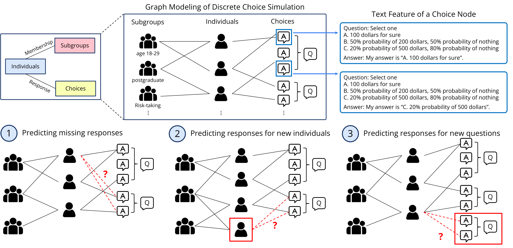

### [GEMS] Rethinking LLM Human Simulation: When a Graph is What You Need

<!--- BADGES: START --->
[][#arxiv-paper-package]
[](https://opensource.org/licenses/BSD-3-Clause)


[#license-gh-package]: https://lbesson.mit-license.org/
[#arxiv-paper-package]: https://arxiv.org/abs/xxxx.xxxxx
<!--- BADGES: END --->

<p align="center">
  
</p>

LLMs are increasingly used to simulate humans, with applications ranging from survey prediction to decision-making. **However, are LLMs strictly necessary?**

We identify a large class of simulation problems in which individuals make choices among discrete options, where a GNN can match or surpass strong LLM baselines.
We call our overall approach as  **GEMS** (Graph-basEd Models for human Simulation).
For more details, please check out our [paper](https://arxiv.org/abs/xxxx.xxxxx).

---

# Installation

To install the required packages, you can create a conda environment, clone, and install the dependencies as:
```bash
conda create -n gems python=3.12 -y
conda activate gems

git clone git@github.com:schang-lab/gems.git
cd gems
pip install -r requirements.txt
pip install -e .
```
The requirements file was generated by
```bash
pip install pip-tools
pip-compile --output-file=requirements.txt requirements.in
```

# Preparing input data

In this section, we describe the following.

(1) [Downloading data from original data providers](#1-downloading-data)

(2) [Dataset specific preprocessing steps after the download](#2-dataset-specific-preprocessing)

(3) [Train / evaluation split generation](#3-split-generation)

(4) [Embedding preparation for few-shot prompting / fine-tuning (*LLM baselines*)](#4-1-preparing-text-embeddings-for-few-shot-prompting--fine-tuning)
[and LLM-to-GNN representation mapping (*GEMS*)](#4-2-extracting-llm-embeddings-for-llm-to-gnn-mapping)

## 1. Downloading data

text

## 2. Dataset specific preprocessing

text

## 3. Split generation

To ensure both **GEMS** and LLM-based methods have the same train and evaluation data, we make train / evaluation split in advance.
This is handled by `scripts/preprocessing/run_dataset_split.py` as follows:

```bash
python scripts/preprocessing/run_dataset_split.py \
 --dataset opinionqa \
 --split_axis individual \
 --test_ratio 0.60 \
 --val_ratio 0.05 \
 --eval_partial_ratio 0.40 \
 --seed 42
```

- `dataset` is the name of dataset to use, one of `opinionqa, twin, eedi, dunning_kruger`. 
- `split_axis` determines how the dataset will be split. In setting 1 (imputation) and 2 (new, unseen individuals), `split_axis=individual`.
In setting 3 (new, unseen questions), `split_axis=question`.
- `test_ratio` is the test split ratio.
- `val_ratio` is the validation split ratio. `1-test_ratio-val_ratio` will be the training split ratio.
- `eval_partial_ratio` is *only* used in the setting 1 (imputation) where 40% of responses from individuals held out for validation/test are avaliable during training.
- `seed` is the random seed for generating splits.

Output files will be located on the `output/dataset_splits` directory, with a file name following the format defined as `SAVING_FORMAT` in `scripts/preprocessing/run_dataset_split.py`.

## 4-1. Preparing text embeddings for few-shot prompting / fine-tuning

In setting 1 (predicting missing responses) and setting 3 (predicting responses for new, unseen questions)
where few-shot prompting / fine-tuning is available,
we prepare the text embeddings of questions in advance to select in-context examples (prior responses).
This is handled by `scripts/preprocessing/run_text_embedding.py` as follows:

```bash
python scripts/preprocessing/run_text_embedding.py \
 --json data/opinionqa/opinionqa_option_strings.json \
 --model_name gemini-embedding-001
```

- `json` is a path to the textual information file which contains a dictionary of each choice nodes' textual information.
Please refer to `data/opinionqa/opinionqa_option_strings.json` to see the file structure.
- `model_name` is the text embedding model to use through API calls, e.g., `gemini-embedding-001`, `text-embedding-3-small`, and `text-embedding-3-large`.

Output files will be located on the `output/text_embeddings` directory, with a file name following the format `{dataset_name}_text_embeddings_{model_name}.pth`.

## 4-2. Extracting LLM embeddings for LLM-to-GNN mapping

In setting 3 (predicting responses for new, unseen questions) a representation mapping from LLM hidden states to GNN output node embeddings is trained.
Training the mapping layer requires preparing LLM hidden states for choice nodes in advance, which is handled by `scripts/preprocessing/run_embedding_extract.py` as follows:

```bash
python scripts/preprocessing/run_hidden_extract.py \
 --json data/opinionqa/opinionqa_option_strings.json \
 --model meta-llama/Llama-2-7b-hf \
 --out outputs/llm_embeddings \
 --n_workers 1 \
 --layer "all" \
 --extract_position before_eos
```
- `json` is a path to the textual information file which contains a dictionary of each choice nodes' textual information.
- `model` is the Huggingface model path, e.g., `meta-llama/Llama-2-7b-hf`.
- `out` is a path to the directory where the output file will be saved.
- `n_workers` is the number of GPUs to use (default: `1`). The script uses FSDP when `n_workers > 1`.
- `layer` is the transformer layer index from which to extract hidden states, while setting to `all` extracts hidden states across all layers  (default: `all`).
Note that the 0th layer is output of the embedding layer, and the -1th layer is the hidden state just before LM head.
- `extract_position` is the token position from which to extract hidden states (default: `before_eos`, choices: `eos`, `before_eos`).
If set to `before_eos`, it extracts from the last token position of the input string; if set to `eos`, extracts from the `eos` token appended at the end of input string.

Additionally, we support `lora_path` argument (default: `None`) to support extracting LLM hidden states from LoRA fine-tuned LLMs.
Output files will be located on the `output/llm_embeddings` directory, with a file name following the format defined as `SAVING_FORMAT` in `scripts/preprocessing/run_hidden_extract.py`.

# LLM Baselines

## Converting dataset split to text input / output

Here we generate input prompt from the [generated split](#3-split-generation), to prompt or fine-tune LLMs.
This is handled by `scripts/preprocessing/run_prompt_formulation.py` as follows:

```bash
python scripts/preprocessing/run_prompt_formulation.py \
 --dataset opinionqa \
 --top_k 3 \
 --text_embedding_path outputs/text_embeddings/opinionqa_text_embeddings_gemini-embedding-001.pth \
 --split_path outputs/dataset_splits/opinionqa_individual_val0p05_test0p60_evalpartial_0p40_seed42.jsonl
```

- `dataset` is the name of dataset to use, one of `opinionqa, twin, eedi, dunning_kruger`. 
- `top_k` is the number of few-shot examples to include in the input prompt, with 0 (default) to generate a zero-shot prompt.
- `text_embedding_path` is the filepath to [precomputed text embeddings](#4-1-preparing-text-embeddings-for-few-shot-prompting--fine-tuning).
It is required to select semantically relevant few-shot examples with respect to the query question.
When `top_k=-1`, this argument is not used since we don't have to search for few-shot examples.
- `split_path` is the filepath to [precomputed train/eval dataset split](#3-split-generation).

Output files will be located on the `output/llm_prompts` directory, with a file name following the format defined as `SAVING_FORMAT`.

## Inference

### Zero-shot prompting, few-shot prompting

Now that the dataset is converted to pairs of (input prompt, human answer) at `output/llm_prompts` directory,
we run the prompting as follows and calculate the prediction accuracy by comparing the highest-probability next token
to the answer token (e.g., 'D') as follows. We use vLLM for inference.

```bash
python scripts/llm/run_prompting.py \
 --input_path outputs/llm_prompts/opinionqa_individual_val0p05_test0p60_evalpartial_0p40_seed42_topk_3_test.jsonl \
 --base_model_name_or_path meta-llama/Llama-2-7b-chat-hf \
 --is_chat \
 --tp_size 1 \
 --gpu-memory-utilization 0.9 \
 --use_logger
```

- `input_path` is the path to input prompt and target token generated in the [previous step](#converting-dataset-split-to-text-input--output).
- `base_model_name_or_path` is the Huggingface model, default to `meta-llama/Llama-2-7b-chat-hf`.
- `is_chat` flag indicates whether the provided `base_model_name_or_path` model is a chat model.
- `tp_size` is tensor parallel size, i.e., the number of GPUs for inference, default to 1.
- `gpu-memory-utilization` is vLLM GPU memory utilization rate, default to 0.9.
- `use_logger` flag indicates to save the stdout and stderr to a separate file, which will be located at `outputs/logs` named by `llm_inference_{initial timestamp}.log`.

At the end of inference, it will provide the accuracy metric as follows:

```bash
{timestamp} - INFO - --> inference_offline: accuracy = {number of correct samples}/{total samples} = {prediction accuracy}
{timestamp} - INFO - --> inference_offline: probability mass sum average: {probability mass mean} +/- {probability mass std}
```

### Agentic CoT

We adopt the method introduced in [Generative Agent Simulations of 1,000 People](https://arxiv.org/abs/2411.10109)
consisted of Reflection module followed by Prediction Module.
The output of Prediction Module, structured in a JSON format, is compared against the human response to measure accuracy.
You can run the script as follows:

```bash
python scripts/llm/run_agentic_cot.py \
```

text

## Fine-tuning

We build on [llama-cookbook](https://github.com/meta-llama/llama-cookbook).
The following command takes files in the `outputs/llm_outputs` directory, and trains a LoRA module.
We note that the following command is an example hyperparameter used throughout the baseline experiments; refer to the appendix section of the paper for hyperparameter selection.

```bash
export HF_TOKEN=${YOUR_HF_TOKEN}
```

At each training epoch, the prediction accuracy for validation and test split is measured;
we use the test accuracy at the maximum validation accuracy.

# Training GEMS

text

## Contact
For any questions or issues about the paper and implementation, please open an issue or contact josephsuh@berkeley.edu.

## Citation

coming soon!