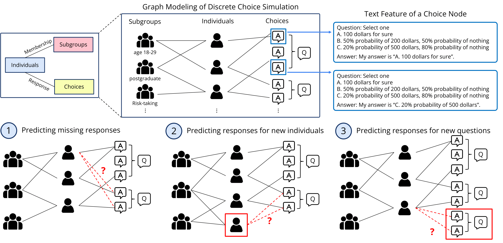

### [ACL 2026 Long Main] GEMS: Graph-Based Alternatives to LLMs for Human Simulation

<!--- BADGES: START --->

[][#arxiv-paper-package]
[](https://opensource.org/licenses/BSD-3-Clause)

[#license-gh-package]: https://lbesson.mit-license.org/
[#arxiv-paper-package]: http://arxiv.org/abs/2511.02135

<!--- BADGES: END --->

<p align="center">
  
</p>

LLMs are increasingly used to simulate humans, with applications ranging from survey prediction to decision-making. **However, are LLMs strictly necessary?**

We identify a large class of simulation problems in which individuals make choices among discrete options, where a GNN can match or surpass strong LLM baselines.
We call our approach **GEMS** (Graph-basEd Models for human Simulation).
For more details, check out our [paper](http://arxiv.org/abs/2511.02135).

---

# Installation

To install the required packages, you can create a conda environment, clone, and install the dependencies as:

```bash
conda create -n gems python=3.12 -y
conda activate gems

git clone git@github.com:schang-lab/gems.git
cd gems
pip install -r requirements.txt
pip install -e .
```

The requirements file was generated by

```bash
pip install pip-tools
pip-compile --output-file=requirements.txt requirements.in
```

For Python 3.10 compatibility, use `requirements_old.txt` instead of `requirements.txt`.

# Preparing input data

In this section, we describe the following.

(1) [Downloading data from original data providers](#1-downloading-data)

(2) [Dataset-specific preprocessing steps after the download](#2-dataset-specific-preprocessing)

(3) [Train / evaluation split generation](#3-split-generation)

(4) [Embedding preparation for few-shot prompting / fine-tuning (*LLM baselines*)](#4-1-preparing-text-embeddings-for-few-shot-prompting--fine-tuning)
[and LLM-to-GNN representation mapping (*GEMS*)](#4-2-extracting-llm-embeddings-for-llm-to-gnn-mapping)

## 1. Downloading data

We use three datasets:

* [OpinionQA](https://arxiv.org/abs/2303.17548) public opinion polls
* [Twin-2k](https://arxiv.org/abs/2505.17479) dataset
* [Replication study of the Dunning-Kruger effect](https://www.nature.com/articles/s41562-021-01057-0) results

Related materials for each dataset are at `/data`.
For Twin-2k and the Dunning–Kruger effect study,
no manual download is required since the datasets are available on HuggingFace.
For OpinionQA, to follow the data terms-of-use guidelines from the original dataset provider,
[Pew Research Center](https://www.pewresearch.org/), we ask you to download it manually from
[here](https://www.pewresearch.org/american-trends-panel-datasets/).
You will be required to sign up and agree to the dataset usage terms before downloading.
In particular, download the results for waves `26,29,32,34,36,41,42,43,45,49,50,54,82,92` and place the `.sav` files in the `data/opinionqa/raw_data/` directory.

## 2. Dataset-specific preprocessing

For Twin-2k and the Dunning–Kruger effect study,
we provide a preprocessing Python notebook `{dataset_name}_data_processor.ipynb` in each dataset directory `/data/{dataset_name}`.
For OpinionQA, no preprocessing is required as long as you have placed the `.sav` files as described in the previous section.

## 3. Split generation

To ensure both **GEMS** and LLM-based methods have the same training and evaluation data, we create the train/evaluation split in advance.
This is handled by `scripts/preprocessing/run_dataset_split.py` as follows:

```bash
python scripts/preprocessing/run_dataset_split.py \
 --dataset opinionqa \
 --split_axis individual \
 --test_ratio 0.60 \
 --val_ratio 0.05 \
 --eval_partial_ratio 0.40 \
 --seed 42
```

* `dataset` is the name of the dataset to use, one of `opinionqa, twin, dunning_kruger`.
* `split_axis` determines how the dataset will be split. In setting 1 (imputation) and 2 (new, unseen individuals), use `split_axis=individual`.
  In setting 3 (new, unseen questions), use `split_axis=question`.
* `test_ratio` is the test split ratio.
* `val_ratio` is the validation split ratio. `1 - test_ratio - val_ratio` will be the training split ratio.
* `eval_partial_ratio` is *only* used in setting 1 (imputation), where 40% of responses from individuals held out for validation/test are available during training.
* `seed` is the random seed for generating splits. For example, one case use seeds `41,42,43`.

Output files will be located in the `outputs/dataset_splits` directory, with a file name following the format defined as `SAVING_FORMAT` in `scripts/preprocessing/run_dataset_split.py`.

## 4-1. Preparing text embeddings for few-shot prompting / fine-tuning

In setting 1 (predicting missing responses) and setting 3 (predicting responses for new, unseen questions),
where few-shot prompting / fine-tuning is available,
we prepare the text embeddings of questions in advance to select in-context examples (prior responses).
This is handled by `scripts/preprocessing/run_text_embedding.py` as follows:

```bash
python scripts/preprocessing/run_text_embedding.py \
 --json data/opinionqa/opinionqa_option_strings.json \
 --model_name gemini-embedding-001
```

* `json` is a path to the textual information file which contains a dictionary of each choice node’s textual information.
  Please refer to `data/opinionqa/opinionqa_option_strings.json` to see the file structure.
* `model_name` is the text embedding model to use through API calls, e.g., `gemini-embedding-001`, `text-embedding-3-small`, and `text-embedding-3-large`.

Output files will be located in the `outputs/text_embeddings` directory, with a file name following the format `{dataset_name}_text_embeddings_{model_name}.pth`.

## 4-2. Extracting LLM embeddings for LLM-to-GNN mapping

In setting 3 (predicting responses for new, unseen questions), we train a representation mapping from LLM hidden states to GNN output node embeddings.
Training the mapping layer requires preparing LLM hidden states for choice nodes in advance, which is handled by `scripts/preprocessing/run_hidden_extract.py` as follows:

```bash
python scripts/preprocessing/run_hidden_extract.py \
 --json data/opinionqa/opinionqa_option_strings.json \
 --model meta-llama/Llama-2-7b-hf \
 --out outputs/llm_embeddings \
 --n_workers 1 \
 --layer "all" \
 --extract_position before_eos
```

* `json` is a path to the textual information file which contains a dictionary of each choice node’s textual information.
* `model` is the Hugging Face model path, e.g., `meta-llama/Llama-2-7b-hf`.
* `out` is a path to the directory where the output file will be saved.
* `n_workers` is the number of GPUs to use (default: `1`). The script uses FSDP when `n_workers > 1`.
* `layer` is the transformer layer index from which to extract hidden states; setting it to `all` extracts hidden states across all layers (default: `all`).
  Note that the 0th layer is the output of the embedding layer, and the -1st layer is the hidden state just before the LM head.
* `extract_position` is the token position from which to extract hidden states (default: `before_eos`, choices: `eos`, `before_eos`).
  If set to `before_eos`, it extracts from the last token position of the input string; if set to `eos`, it extracts from the `eos` token appended at the end of the input string.

Additionally, we support a `lora_path` argument (default: `None`) to extract LLM hidden states from LoRA‑fine‑tuned LLMs.
Output files will be located in the `outputs/llm_embeddings` directory, with a file name following the format defined as `SAVING_FORMAT` in `scripts/preprocessing/run_hidden_extract.py`.

# LLM Baselines

## Converting dataset split to text input / output

Here we generate input prompts from the [generated split](#3-split-generation), to prompt or fine-tune LLMs.
This is handled by `scripts/preprocessing/run_prompt_formulation.py` as follows:

```bash
python scripts/preprocessing/run_prompt_formulation.py \
 --dataset opinionqa \
 --top_k 3 \
 --text_embedding_path outputs/text_embeddings/opinionqa_text_embeddings_gemini-embedding-001.pth \
 --split_path outputs/dataset_splits/opinionqa_individual_val0p05_test0p60_evalpartial_0p40_seed42.jsonl
```

* `dataset` is the name of the dataset to use, one of `opinionqa, twin, dunning_kruger`.
* `top_k` is the number of few-shot examples to include in the input prompt, with 0 (default) to generate a zero-shot prompt.
* `text_embedding_path` is the filepath to [precomputed text embeddings](#4-1-preparing-text-embeddings-for-few-shot-prompting--fine-tuning).
  It is required to select semantically relevant few-shot examples with respect to the query question.
  When `top_k=-1`, this argument is not used since we don't have to search for few-shot examples.
* `split_path` is the filepath to the [precomputed train/eval dataset split](#3-split-generation).

Output files will be located in the `outputs/llm_prompts` directory, with a file name following the format defined as `SAVING_FORMAT`.

## Inference

### Zero-shot prompting, few-shot prompting

Now that the dataset is converted to pairs of (input prompt, human answer) in the `outputs/llm_prompts` directory,
we run the prompting and calculate the prediction accuracy by comparing the highest-probability next token
to the answer token (e.g., `D`). We use [vLLM](https://github.com/vllm-project/vllm) for inference.

```bash
python scripts/llm/run_prompting.py \
 --input_path outputs/llm_prompts/opinionqa_individual_val0p05_test0p60_evalpartial_0p40_seed42_topk_3_test.jsonl \
 --base_model_name_or_path meta-llama/Llama-2-7b-chat-hf \
 --is_chat \
 --tp_size 1 \
 --gpu-memory-utilization 0.9 \
 --use_logger
```

* `input_path` is the path to input prompts and target tokens generated in the [previous step](#converting-dataset-split-to-text-input--output).
* `base_model_name_or_path` is the Hugging Face model (default: `meta-llama/Llama-2-7b-chat-hf`).
* `is_chat` indicates whether the provided `base_model_name_or_path` is a chat model.
* `tp_size` is tensor-parallel size, i.e., the number of GPUs for inference (default: 1).
* `gpu-memory-utilization` is the vLLM GPU memory utilization rate (default: 0.9).
* `use_logger` saves `stdout` and `stderr` to a separate file, which will be located at `outputs/logs` and named `llm_inference_{timestamp}.log`.

At the end of inference, it will provide the accuracy metric as follows:

```bash
{timestamp} - INFO - --> inference_offline: accuracy = {number of correct samples}/{total samples} = {prediction accuracy}
{timestamp} - INFO - --> inference_offline: probability mass sum average: {probability mass mean} +/- {probability mass stdev}
```

### Agentic CoT

We adopt the method introduced in [Generative Agent Simulations of 1,000 People](https://arxiv.org/abs/2411.10109),
consisting of a Reflection module followed by a Prediction module.
The output of the Prediction module, structured in JSON, is compared against the human response to measure accuracy.
You can run the script as follows:

```bash
python scripts/llm/run_agentic_cot.py \
 --input_path outputs/llm_prompts/opinionqa_individual_val0p05_test0p60_evalpartial_0p40_seed42_topk_3_test.jsonl \
 --base_model_name_or_path meta-llama/Llama-2-7b-chat-hf \
 --is_chat \
 --tp_size 1 \
 --gpu-memory-utilization 0.9 \
 --use_logger
```

Command-line arguments and the printed accuracy metrics are identical to those for zero-shot / few-shot prompting.

*Note:* when you use a long context window model (e.g., `Qwen/Qwen3-8B`), total inference time can be exceptionally long. This is not a bug; some generations are indeed very long.

## Fine-tuning

We build on [llama-cookbook](https://github.com/meta-llama/llama-cookbook).
The following command takes files in the `outputs/llm_outputs` directory and trains a LoRA module.
We note that the following command provides example hyperparameter values used throughout the baseline experiments; refer to the appendix of the paper for hyperparameter selection.

```bash
export HF_TOKEN=${YOUR_HF_TOKEN}
export WANDB_API_KEY=${WANDB_API_KEY} # optional
export TOKENIZERS_PARALLELISM=true    # optional

NPROC_PER_NODE=2
BATCH_SIZE=256
GRADACC_STEPS=4
PROC_BATCH_SIZE=$(( BATCH_SIZE / (NPROC_PER_NODE * GRADACC_STEPS) ))
CURRENT_TIME_STR=$(date +"%Y%m%d_%H%M%S")
LORA_RANK=8
LORA_ALPHA=32
DATASET="opinionqa_individual_val0p05_test0p60_evalpartial_0p40_seed42_topk_3"
MODEL_NAME="meta-llama/Llama-2-7b-chat-hf"
MODEL_NICKNAME="llama2_7b"

torchrun --nnodes=1 \
    --nproc-per-node=${NPROC_PER_NODE} \
    --master_port=29501 \
    scripts/llm/run_finetuning.py \
    --enable_fsdp \
    --low_cpu_fsdp \
    --fsdp_config.pure_bf16 \
    --use_peft=true \
    --use_fast_kernels \
    --checkpoint_type StateDictType.FULL_STATE_DICT \
    --peft_method='lora' \
    --use_fp16 \
    --mixed_precision \
    --batch_size_training ${PROC_BATCH_SIZE} \
    --val_batch_size ${PROC_BATCH_SIZE} \
    --gradient_accumulation_steps ${GRADACC_STEPS} \
    --dist_checkpoint_root_folder None \
    --dist_checkpoint_folder None \
    --batching_strategy='padding' \
    --dataset_path ${DATASET} \
    --output_dir outputs/llm_finetuning/${DATASET}/${CURRENT_TIME_STR}/ \
    --name ${DATASET}_${MODEL_NICKNAME} \
    --model_name ${MODEL_NAME} \
    --model_nickname ${MODEL_NICKNAME} \
    --is_chat='true' \
    --lr 2e-4 \
    --seed 42 \
    --num_epochs 3 \
    --weight_decay 0 \
    --which_scheduler cosine \
    --warmup_ratio 0.1 \
    --lora_config.r ${LORA_RANK} \
    --lora_config.lora_alpha ${LORA_ALPHA} \
    --wandb_config.project NAME_OF_YOUR_WANDB_PROJECT \
    --wandb_config.entity NAME_OF_YOUR_WANDB_ENTITY
```

Please alter `DATASET`, `MODEL_NAME`, and `MODEL_NICKNAME` for each combination of dataset, base LLM, and your chosen nickname for the base LLM. Also alter `GRADACC_STEPS` appropriately to avoid out-of-memory errors depending on your accelerator VRAM.
At each training epoch, the prediction accuracy for the validation and test splits is measured;
we report the test accuracy from the epoch with the maximum validation accuracy.
Our experiments are conducted using 2× NVIDIA A100-SXM4-80GB GPUs,
either on local machines or the [VESSL AI platform](https://vessl.ai/),
which offers cost‑efficient and easy‑to‑launch training configurations.


# Training GEMS

## Setting 1 (missing responses)

The Hydra config file for GNN training is located at `sibyl/config/graph/gems_training_config.yaml`.
At a high level, it configures:
(1) the GNN input feature table (`encoder`);
(2) the GNN encoder architecture (`gnn`);
(3) the decoder, which defaults to dot product + softmax (`decoder`);
(4) the dataset (`dataset`);
(5) edge splitting into message‑passing and supervision edges during training (`split_info`);
(6) training hyperparameters (`training`);
(7) experiment config (`experiment`).
Please refer to the comments in the config file for more details.

GNN training is handled by `scripts/graph/train.py`.
The following command is specifically for **Setting 1** (imputing missing responses);
for **Settings 2** and **3**, see the next two sections.
As mentioned in the paper’s Experiments section, at each training step, 50% of the available response (individual–question) edges are masked and used as supervision edges,
with the remaining 50% used as message‑passing edges (`split_info.transductive.train.indiv_question=0.5`).
Also, as described in the Appendix training details, we use `gnn.add_self_loops=true` for GAT and `false` for RGCN and GraphSAGE.

```bash
DATASET_NAME="opinionqa"
DATASET="opinionqa_individual_val0p05_test0p60_evalpartial_0p40_seed42"
GNN_ARCH="rgcn"
ADD_SELF_LOOPS=false
SEED=42

python scripts/graph/train.py \
    dataset.dataset_name="${DATASET_NAME}" \
    dataset.split_filepath="outputs/dataset_splits/${DATASET}.jsonl" \
    gnn.gnn_arch="${GNN_ARCH}" \
    gnn.add_self_loops="${ADD_SELF_LOOPS}" \
    split_info.transductive.train.indiv_question=0.5 \
    split_info.inductive.train.indiv=0.0 \
    training.seed="${SEED}"
```

By default we use `experiment.use_logger=true`, which logs stdout to files under `outputs/logs/gems_training/` with an initial timestamp.

## Setting 2 (new individuals)

The script structure is nearly identical to Setting 1, except for the edge split during training:
in each training step, 50% of individuals are selected,
and all of their response (individual–question) edges are masked and used as supervision edges
(`split_info.inductive.train.indiv=0.5`).

```bash
DATASET_NAME="twin"
DATASET="twin_individual_val0p05_test0p60_evalpartial_0p00_seed42"
GNN_ARCH="sage"
ADD_SELF_LOOPS=false
SEED=42

python scripts/graph/train.py \
    dataset.dataset_name="${DATASET_NAME}" \
    dataset.split_filepath="outputs/dataset_splits/${DATASET}.jsonl" \
    gnn.gnn_arch="${GNN_ARCH}" \
    gnn.add_self_loops="${ADD_SELF_LOOPS}" \
    split_info.transductive.train.indiv_question=0.0 \
    split_info.inductive.train.indiv=0.5 \
    training.seed="${SEED}"
```

## Setting 3 (new questions)

### Stage 1. Perform GNN training to learn representations of choice and individual nodes

```bash
DATASET_NAME="dunning_kruger"
DATASET="dunning_kruger_question_val0p10_test0p20_evalpartial_0p00_seed42"
GNN_ARCH="gat"
ADD_SELF_LOOPS=true
SEED=42

python scripts/graph/train.py \
    dataset.dataset_name="${DATASET_NAME}" \
    dataset.split_filepath="outputs/dataset_splits/${DATASET}.jsonl" \
    gnn.gnn_arch="${GNN_ARCH}" \
    gnn.add_self_loops="${ADD_SELF_LOOPS}" \
    experiment.save_embedding=true \
    split_info.new_question.is_this=true \
    split_info.transductive.train.indiv_question=0.5 \
    split_info.inductive.train.indiv=0.0 \
    training.seed="${SEED}"
```

Compared to Setting 1, there are two changes:
* `experiment.save_embedding=true` saves GNN output node embeddings under `outputs/gems_embeddings/gems_training_{GNN_ARCH}`.
* `split_info.new_question.is_this=true` indicates Setting 3.

As described in the Experiments section, we reserve 5% of the training edges as
'transductive validation edges' and perform imputation training (`split_info.transductive.train.indiv_question=0.5`) as did in Setting 1.
At the checkpoint with the best prediction accuracy on the 'transductive validation edges',
we save the GNN output node embeddings for each choice and individual.
Saved choice node embeddings are used in the stage 2 to learn a LLM-to-GNN mapping.

### Stage 2. Train the LLM‑to‑GNN representation mapping

```bash
DATASET_NAME="dunning_kruger"
GNN_ARCH="gat"
LLM_MODEL_NICKNAME="llama2_7b"
OUTPUT_EMBEDDING_FILENAME=YOUR_OUTPUT_EMBEDDING_FILENAME   # output node embeddings from scripts/graph/train.py, stage 1
SEED=42 # seed used when splitting the dataset; must match the dataset used in stage 1

SPLIT_FILENAME="question_val0p10_test0p20_evalpartial_0p00" # setting 3: 10% validation and 20% test questions
GNN_EMBEDDING_PATH="outputs/gems_embeddings/gems_training_${GNN_ARCH}/${OUTPUT_EMBEDDING_FILENAME}.pth"
LLM_EMBEDDING_PATH="outputs/llm_embeddings/${DATASET_NAME}_option_strings_embedding_${LLM_MODEL_NICKNAME}_layer_all_eos_False.pt"
SPLIT_FILEPATH="outputs/dataset_splits/${DATASET_NAME}_${SPLIT_FILENAME}_seed${SEED}.jsonl"

python scripts/graph/llm_to_gnn_mapping.py \
  --dataset_name="${DATASET_NAME}" \
  --gnn_embedding_path="${GNN_EMBEDDING_PATH}" \
  --llm_embedding_path="${LLM_EMBEDDING_PATH}" \
  --split_filepath="${SPLIT_FILEPATH}" \
  --verbose
```

* `dataset_name` is name of the dataset, one of `opinionqa, twin, dunning_kruger`.
* `gnn_embedding_path` is path to the GNN output node embeddings from Stage 1.
* `llm_embedding_path` is path to the [precomputed LLM hidden states](#4-2-extracting-llm-embeddings-for-llm-to-gnn-mapping).
* `split_filepath` is the [dataset split file](#3-split-generation) which must match the file used during Stage 1.
* `verbose` is an optional flag to print more detailed results.

This script reports the test accuracy at the checkpoint with the best validation accuracy.


## Contact

For any questions or issues about the paper and implementation, open an issue or contact [josephsuh@berkeley.edu](mailto:josephsuh@berkeley.edu).

## Citation

```
@article{suh2025rethinking,
  title={Rethinking LLM Human Simulation: When a Graph is What You Need},
  author={Suh, Joseph and Moon, Suhong and Chang, Serina},
  journal={arXiv preprint arXiv:2511.02135},
  year={2025}
}
```
